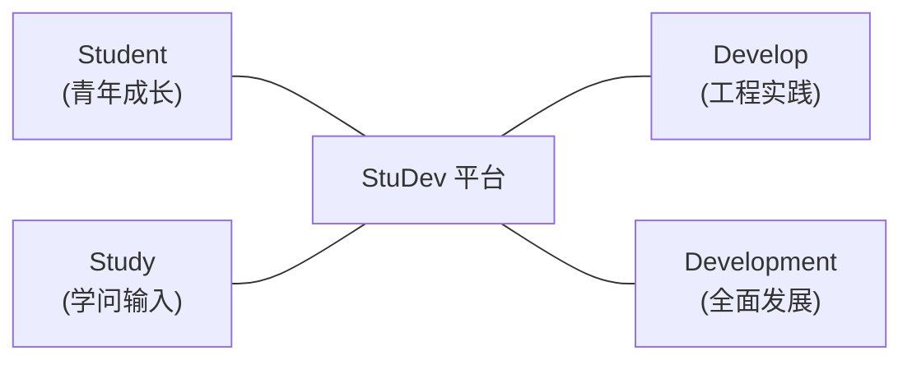

## 名字里的双重隐喻

StuDev 这个名字，包含了两层最直接的含义：

- **Student Development**：这是学院学生发展中心的本职；
- **Study + Develop**：学习知识，动手做出作品。

我们不希望这里只是一个传达通知、统计表格的事务性机构。我们更希望搭建一个==透明、公共的数字小空间==，把南邮同学在大学里沉淀下来的好代码、好经验、好想法，长久地留存下来。

```math
\text{StuDev} = \text{Student Development} \equiv \text{Study} + \text{Develop}
```



---

## 四个部门在做什么

社团由四个部门和统筹协调的学长学姐组成，每个方向都有明确的着力点：

- **运营支持部**：社团运转的后勤枢纽。负责场地借用、物资协调、会议统筹，以及跨学院、跨社团的活动对接，确保大家的想法能够平稳落地；
- **易班建设部**：工程与技术实践方向。负责维护 StuDev 网站本身，探索好用的 AI 工具流，把零散的学习资料整理成可复用的技术资产；
- **媒体宣传部**：文字与视觉表达。负责推文撰写、活动摄影、视觉设计与视频记录，用干净有美感的方式，把同学们做的事情传播出去；
- **心理工作部**：同伴支持与校园交流。关注大家在学业压力、人际交往和大学适应期的真实困惑，组织一些轻松小巧的线下交流与解压活动。

---

## 我们的共识

> [!NOTE]
> **StuDev 的三大工作准则**
> 
> 1. **不搞形式主义**：不为开会而开会，不发没有信息的推文，不折腾繁琐的汇报；
> 2. **代码与内容透明**：StuDev 的网站源码完全公开在 GitHub 上，接受所有人的审阅与建议；
> 3. **以作品为导向**：比起头衔和资历，我们更看重你是不是==真正动手做成过一件具体的事情==。
