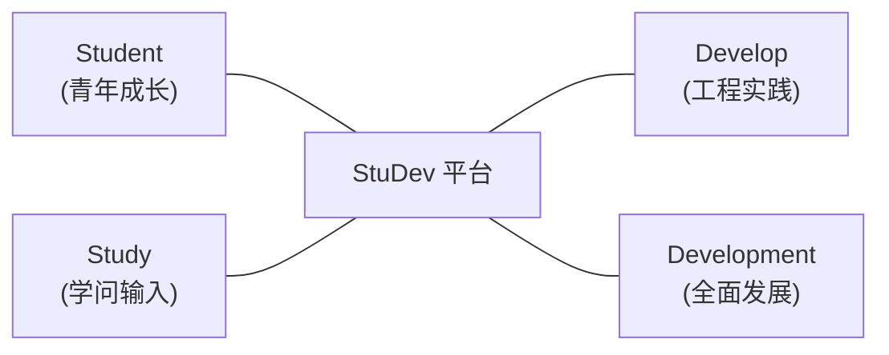

## 名字里的双重隐喻

StuDev 这个名字，包含了两层最直接的含义：

- **Student Development**：南京邮电大学计算机学院、软件学院、网络空间安全学院学生发展中心的本职；
- **Study + Develop**：学习知识，动手做出真实可用的工程作品。

我们不希望这里只是一个传达通知、统计表格的事务性机构。我们致力于搭建一个==透明、公共、本地优先的数字校园与社团知识空间==，既为全校师生提供日常高频使用的课表、考务、三维校园地图与全文检索工具，也把南邮同学在大学里沉淀下来的好代码、好经验、好想法长久留存下来。

```math
\text{StuDev} = \text{Student Development} \equiv \text{Study} + \text{Develop}
```


```mermaid
flowchart LR
    A["Student<br/>(青年成长)"] --- B["StuDev 平台"]
    C["Study<br/>(学问输入)"] --- B
    B --- D["Develop<br/>(工程实践)"]
    B --- E["Development<br/>(全面发展)"]
```

---

## 为什么构建 StuDev 数字校园

高校日常教学与校园生活的信息往往分散在彼此孤立的系统中：查课表与考场需要翻阅多层表格，找一间自习空教室需要逐层推门，查一份培养方案或通知附件需要遍历十几个二级站点，而学生社团历年沉淀的技术文章与学业经验则随着换届散落在群聊与网盘里。

StuDev 将**课表、考务、校历、三维教学楼与全文检索**统一在同一套校园时空数据模型之下，在 [网页端](/) 与 [原生 Android 客户端](/download/) 提供一致的本地优先体验：

1. **免登录即用，个人设置端侧自治**：课表、考试安排、校历、空闲教室、三维校园地图与全文检索无需注册登录即可使用。选定的班级、自定义加减课、早锻炼打卡记录与提醒偏好全部保存在终端设备本地，服务器不接收、不记录任何个人查询轨迹。
2. **教学、考务与校历同轴推演**：日常课程、期末考试、集中实践周、法定节假日、调休补课、运动会、校庆日与早锻炼在同一套时间模型上精确计算，支持按**天 / 周 / 二十周学期全景**三级尺度切换，并可一键导出 `.ics` 日历或写入手机系统日历。
3. **室内外一体化三维校园地图**：基于 MapLibre GL 构建全校三维建筑与教学楼分层室内平面。拨动时间刻度尺至任意时刻，三维教学楼剖面图即刻映射每一层、每一间教室的实时空闲与课程占用状态，并支持跨楼栋、跨楼层步行路径规划。
4. **端侧 Rust + WebAssembly 毫秒级检索**：无需后端搜索服务器，在浏览器与客户端本地毫秒级同时检索全校课程、教师、班级、教室、公开通知及附件正文。


*周课表视图：同一张课表内的课程按 30° 等距色环联合分配色彩，单双周非上课周就地保留并以灰度标注。*


*二十周学期全景：课程、考试、实践周与法定节假日调休同轴展示，底部附带已核验的考务通知来源。*


*三维校园地图：点击任意教学楼即可逐层剖切（1F–6F），绿色房间代表当前空闲自习教室，蓝色代表正在上课。*


*端侧全文检索：基于 Rust 编译的紧凑二进制倒排索引，在本地毫秒级检索课程、教师、教室、通知附件与社团文章。*

---

## 四个部门在做什么

学生发展中心由四个部门和统筹协调的学长学姐组成，每个方向都有明确的着力点：

- **运营支持部**：社团运转的后勤枢纽。负责场地借用、物资协调、会议统筹，以及跨学院、跨社团的活动对接，确保大家的想法能够平稳落地；
- **易班建设部**：工程与技术实践方向。负责研发与维护 [StuDev 开源平台](/develop/platform-studev-core/) 本身，探索好用的 AI 与工程工具流，把零散的学习资料整理成可复用的数字资产；
- **媒体宣传部**：文字与视觉表达。负责推文撰写、活动摄影、视觉设计与视频记录，用干净有美感的方式，把同学们做的事情传播出去；
- **心理工作部**：同伴支持与校园交流。关注大家在学业压力、人际交往和大学适应期的真实困惑，组织草坪音乐节、5·25 心理树洞等轻松真挚的线下交流与解压活动。

---

## 我们的共识与开源共建

> [!NOTE]
> **StuDev 的核心工作准则**
> 
> 1. **求真务实**：专注于切实的同伴支持与学业互助，把精力倾注在对同学成长有实际帮助的具体行动上；
> 2. **代码与内容透明**：StuDev 的全栈源码与社团文章完全开源在 [GitHub (`NJUPT-CS-StuDev/studev`)](https://github.com/NJUPT-CS-StuDev/studev) 上，接受所有人的审阅、勘误与共建；
> 3. **以作品为导向**：比起头衔和资历，我们更看重你是不是==真正动手做成过一件具体的事情==。

StuDev 的底层架构被设计为**学校无关的通用高校数字校园引擎**。全校作息节次、教学周历、建筑平面与地图边界全部解耦在配置文件与静态快照格式中，欢迎全国各高校的学生团队与开发者 Fork 复用或参与共建。

---

## 深度阅读与相关链接

- [《StuDev 网站源码与架构手记》](/develop/platform-studev-core/)：深入了解单源双端时空引擎、跨语言黄金测试向量与构建期静态排版管道；
- [《从草坪与易班走来：StuDev 数字化平台的历史回响》](/about/organizational-genesis/)：2022 至 2026 年，从心理工作站、易班工作室到学生发展中心与开源平台的演进史；
- [下载 Android 客户端](/download/) · [用户协议](/terms/) · [隐私政策](/privacy/) · [GitHub 开源仓库](https://github.com/NJUPT-CS-StuDev/studev)。
