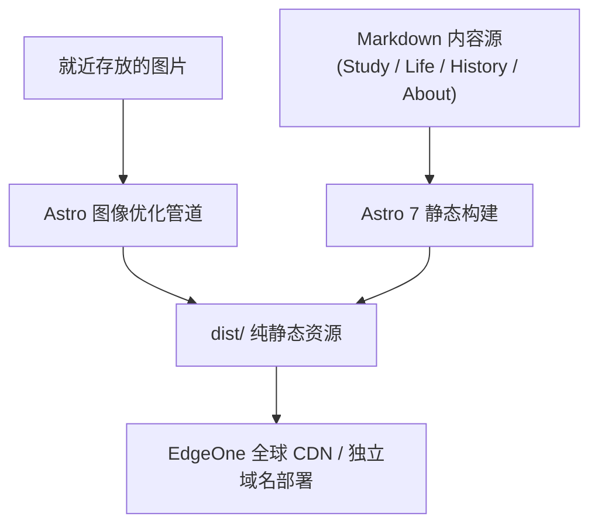

StuDev 是南京邮电大学计软网安学生发展中心的官方网站，也是我们交付给全院同学的第一个开源作品。

## 为什么要做这个项目？

传统的学生组织往往把资料散落在微信推送、班级群文件和个人网盘里。一年换届之后，前人的经验大多遗失殆尽，后人只能重复造轮子。

我们希望用做开源软件的方式来管理社团的资产：

- **单信源（Single Source of Truth）**：所有文章、成员档案、历史事件，全部以结构化的纯文本 Markdown 保存在 Git 仓库中；
- **完全透明**：哪怕是一处错别字的修改，都会在 GitHub 上留下公开可查的 Commit 记录；
- **人人可参与**：只要你会写 Markdown，你就可以提交 Pull Request，把你的文章直接合入官方网站。

---

## 技术架构

站点以静态 HTML 为主；只有页面用到图表时，才加载对应的绘图脚本：



- **构建框架**：[Astro 7](https://astro.build/)（采用纯静态模式，生成全站静态 HTML）；
- **类型系统**：TypeScript + Astro Content Collections（对每篇 Markdown 的元数据进行强类型校验）；
- **样式表现**：原生现代 CSS，以克制的排版、留白和字体层级建立阅读体验，拒绝花哨动效；
- **图像管道**：资源与 Markdown 就近存放，构建时通过 Astro 图像管道优化为 WebP 格式。

---

## 本地运行与共建

如果你想在自己的电脑上运行或修改这个网站，只需要三步：

```bash
# 1. 克隆代码到本地
git clone https://github.com/NJUPT-CS-StuDev/studev.git

# 2. 安装项目依赖
cd studev
npm install

# 3. 启动本地开发预览
npm run dev
```

> [!TIP]
> 运行后在浏览器打开 `http://localhost:4321`，你就能看到一个与线上完全一致的实时预览环境。欢迎为我们指出排版问题，或者提交你的第一行代码。
