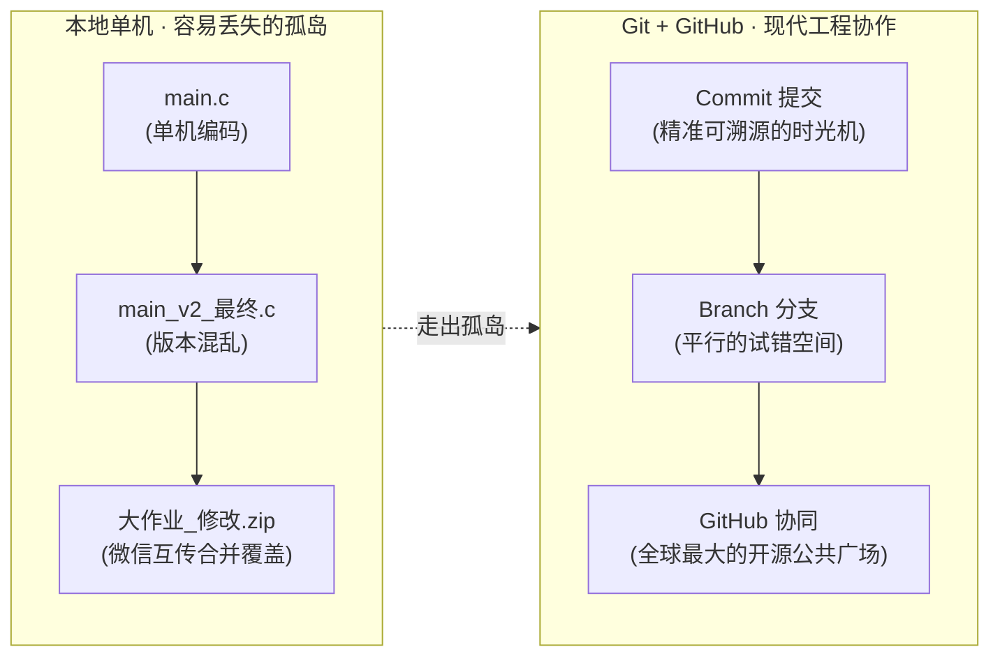
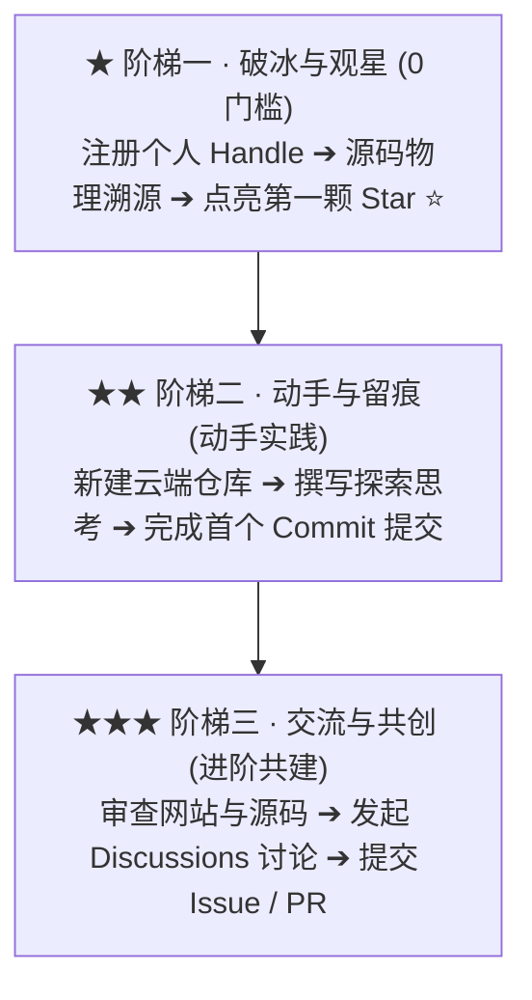
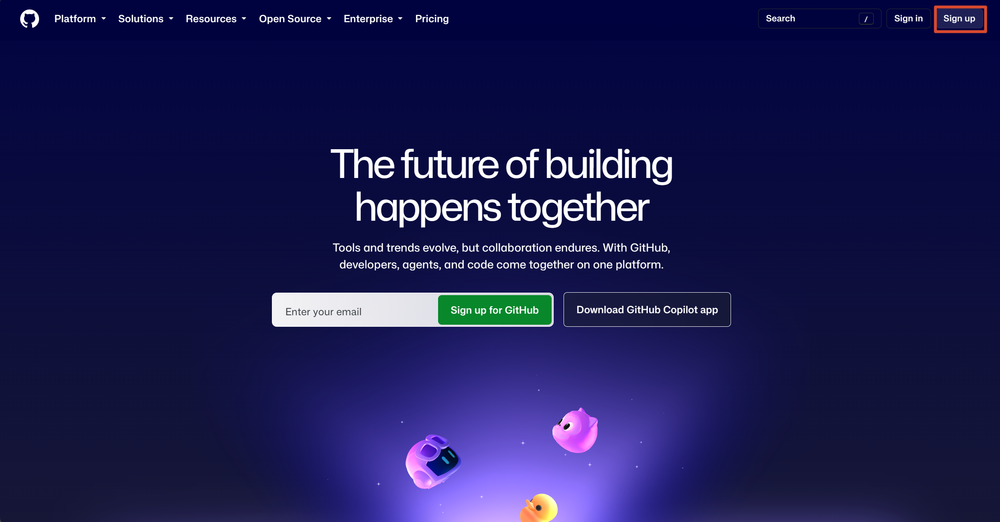
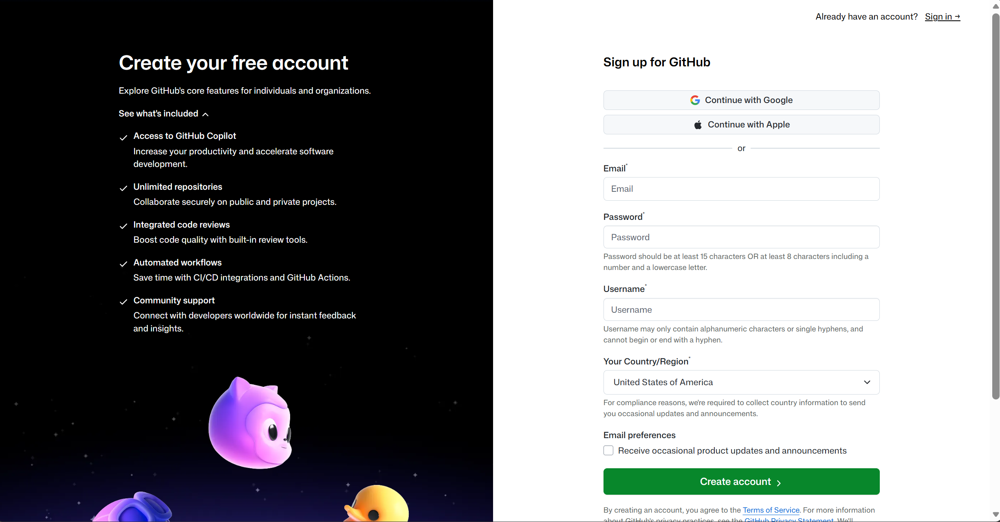
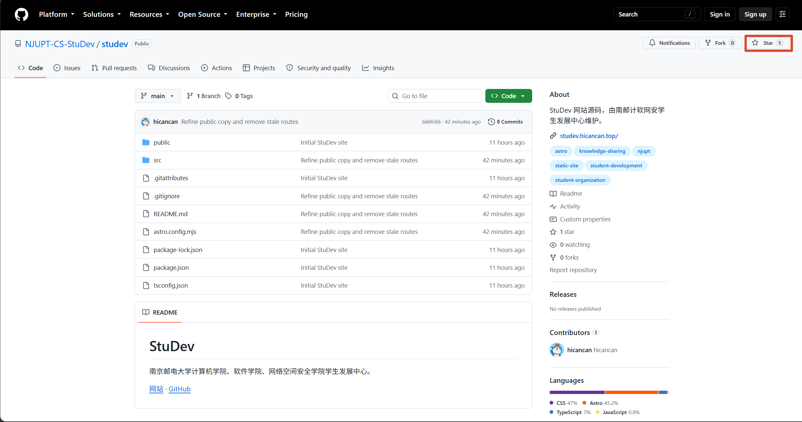
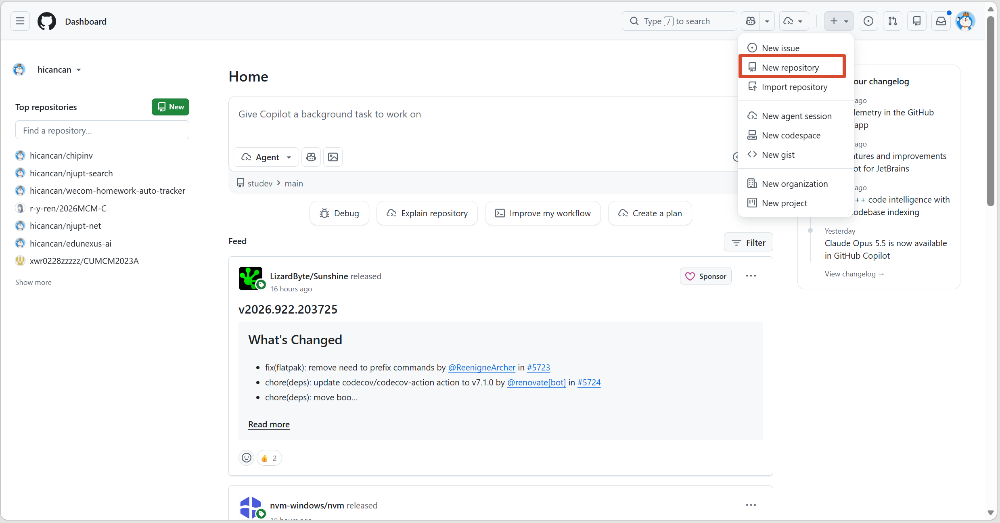
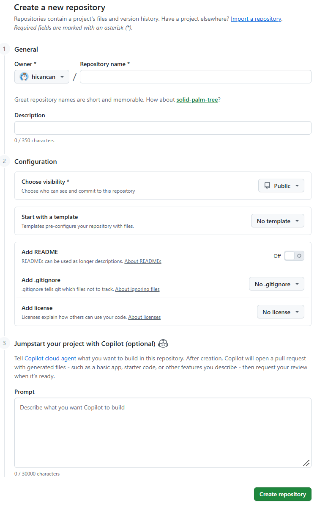
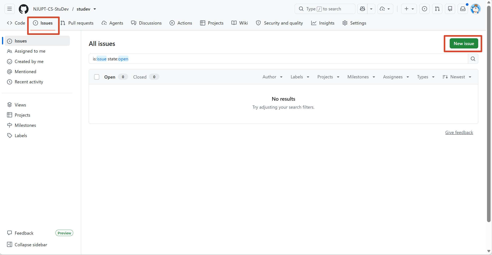
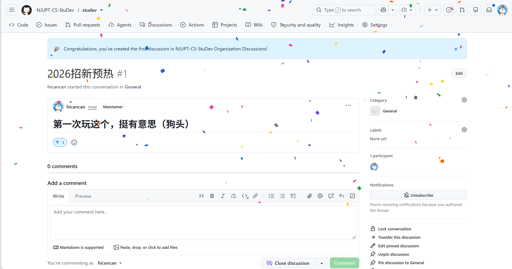

## 序幕 · 走出单机的“小黑框”

每一个计算机专业的同学，往往都是从一台单机电脑的“小黑框”开始敲开代码世界的大门的：在本地编辑器里小心翼翼地敲下几行代码，点击运行，黑底白字的终端一闪，打印出一行 `Hello, World!`。

那是一种纯粹的欣喜。但很快，几乎所有刚接触编程的同学都会遭遇一套普遍而痛苦的现实困境：

1. **版本混乱**：代码越写越多，桌面上的文件渐渐演变成 `main.c`、`main_v2.c`、`main_最终版.c`、`main_真的不改了.c`。一旦改错，连退回昨天的版本都成了一种奢望；
2. **协作灾难**：到了课程大作业或小组项目，几个室友在微信群或 QQ 群里互传压缩包：`大作业_张三修改_李四整合版_最终版2.zip`。文件相互覆盖，代码合并全靠眼瞪，痛苦不堪；
3. **脆弱孤岛**：电脑一旦蓝屏、硬盘损坏或者重装系统，几个月的心血便瞬间化为乌有。

**把代码只留在自己的电脑里，就像把自己的思考锁死在一座与世隔绝的孤岛上。** 

大学计算机教育的第一堂核心大课，绝不仅仅是在本地学会几条语法规则，而是==学会走出孤岛，进入现代软件工程的协作网络==。

---

## 01 · 时光机与全球广场：为什么必须是 GitHub？

要打破单机孤岛，现代工程师依靠两样极其强大的发明：**Git** 与 **GitHub**。



### Git：代码的“时光机与平行宇宙”

2005 年，Linux 之父 Linus Torvalds 为了管理庞大的 Linux 操作系统源码，发明了分布式版本控制系统 Git。

Git 的本质不是一个普通的网盘，而是一座==代码的时光机==：

- 你的每一次修改（**Commit** / 提交），都被精准记录下了时间戳、修改人和具体差异。你可以随时穿越回过去任何一个历史节点；
- 它强大的分支机制（**Branch**），允许成千上万名工程师在各自独立的“平行宇宙”里探索尝试，验证成功后再优雅地合并（**Merge**）在一起，绝不破坏主干稳定。

### GitHub：开源文明的公共图书馆与你的第二张身份证

如果说 Git 是装在你个人电脑里的单机时光机，那么 ==GitHub 就是连接全人类所有时光机的超级公共广场与全球图书馆==。

今天，支撑全球互联网运转的 Linux 内核、Python 解释器，以及最前沿的人工智能模型、前端框架，全人类最顶尖的工程师几乎都毫无保留地将源码公开在 GitHub 上。

**为什么每一个计算机学生都必须尽早建立自己的 GitHub 坐标？**

- **开源是世界上最好的大学**：你不必苦等课堂进度。世界上最高水平、最符合工业级规范的优雅代码，全天候免费向你敞开。阅读别人的代码，是程序员成长最快的捷径；
- **代码即名片（==Proof of Work==）**：在真实的技术社区和未来的升学、就业竞争中，教务系统的期末绩点只是一张纸；而在 GitHub 上的持续贡献、绿格子、真实提交记录和开源作品，才是全世界通行的技术硬通货，是任何人都无法伪造的真实造物能力凭证；
- **从消费者跃升为创造者**：在网络上，大部分人终其一生只是软件的“被动消费者”；但只要你拥有 GitHub 账号，哪怕你只是给一个开源项目指出了一处文档错别字、提了一个 Issue，你都完成了==从“看客”到“数字世界共建者”的跃迁==。

---

## 02 · StuDev 的透明底色：你的第一块试验田

“南京邮电大学计软网安学生发展中心”为什么要花费精力打造一个完全开源的网站系统？

因为我们希望它是一个真正开放、透明的公共社区。

```math
\text{StuDev} = \text{Student Development} \equiv \text{Study} + \text{Develop}
```

这个你正在浏览的网站（[studev.hicancan.top](https://studev.hicancan.top)），每一个页面、每一个像素背后的源文件，都在 [StuDev 的 GitHub 仓库](https://github.com/NJUPT-CS-StuDev/studev) 中公开陈列、接受全校同学的审视与考验。

它不是某个大佬的私人展示橱窗，而是==我们为你量身准备的“新手村第一块沙盒与试验田”==。你不需要害怕犯错，这里所有的代码、文档和流程，都欢迎你推门进来探索。

---

## 03 · 探索阶梯：从观星者到共建者

为了让大家在实践中真正理解 Git 与 GitHub 的工作哲学，我们设计了==三道梯度分明的成长阶梯==。

> [!NOTE]
> **写在前面的原则**  
> 
> 我们注重的是==真实的动手能力、独立思考与探索的好奇心==，而不是形式主义的打卡完成率。你可以根据自己的节奏探索，哪怕只完成第一级，也是一次极其宝贵的突破。



### 任务打卡清单（可在 Typora 中直接勾选打卡）

- [ ] **★ 阶梯一 · 观星者（0 门槛）**：注册个人 GitHub Handle，在 StuDev 仓库物理溯源并点亮第一颗 <kbd>Star ⭐️</kbd>
- [ ] **★★ 阶梯二 · 记录者（动手级）**：新建云端 `my-first-repo`，编写首篇 `README.md` 并完成人生首个 <kbd>Commit</kbd> 提交
- [ ] **★★★ 阶梯三 · 共建者（进阶级）**：审查 StuDev 网站与源码，在 Discussions 发起讨论、提交 Issue 反馈或发起 PR

---

### ★ 阶梯一：破冰与观星（观星者 · 0 门槛）

**目标**：扫清访问路障，建立属于你的开发者网络身份，亲眼看清代码与网页的映射关系。

#### 步骤 1：注册你的 GitHub Handle

1. 访问 [GitHub 官网 (github.com)](https://github.com)；
2. 点击右上角 <kbd>Sign up</kbd> 注册账号；
3. **认真选取你的用户名（Username）**：建议使用你的真实英文名、拼音缩写或具有长期辨识度的代号。这个用户名将在未来陪伴你四年的技术成长，成为你在技术社区的终身名片。





> [!TIP]
> **关于如何顺畅访问 GitHub**  
> 
> 在大学里，==学会自主信息检索是计算机专业极其重要的核心能力==。如果在校园网或特定网络下遇到连接缓慢或打不开，不要气馁，尝试去 **B站** 或 **知乎** 搜索最新的解决方案——例如很多同学在用的 **Watt Toolkit（原名 Steam++，开源网络加速工具）**、**网易 UU 加速器（常提供免费的学术与 GitHub 节点加速）**，或者学习配置 Host 镜像等等。独立排查并解决网络路障，是你成为开发者的第一场实战演练。

#### 步骤 2：源码物理溯源

1. 打开 [StuDev 的官方 GitHub 仓库](https://github.com/NJUPT-CS-StuDev/studev)；
2. 在文件列表中，顺着路径点开：`src` $\to$ `pages` $\to$ `index.astro`；
3. 对照着你正在访问的 [StuDev 网站首页](https://studev.hicancan.top/)，仔细看一眼代码文件：找一找哪一行写出了网站的名字，哪一行定义了首页的介绍文字。

> [!TIP]
> **打破对“软件”的神秘感**  
> 
> 此时你会亲眼见证：==原来浏览器里看到的精美布局，本质上就是由这些结构化的纯文本文件渲染而来的！==

#### 步骤 3：点亮你的第一颗 Star ⭐️

1. 回到 [StuDev 仓库主页](https://github.com/NJUPT-CS-StuDev/studev)；
2. 找到页面右上角的 <kbd>Star ⭐️</kbd> 按钮，点击点亮。



> [!NOTE]
> **理解开源文化中的 Star ⭐️**  
> 
> 在 GitHub 上，Star 绝不是社交媒体上廉价的刷赞，而是工程师之间最真挚的==致敬、收藏与信标==。点亮它，代表你正式收藏了这份开源项目，并将它作为你进入开源世界的第一个坐标。

---

### ★★ 阶梯二：留下足迹（记录者 · 独立实践）

**目标**：摆脱本地文件命名的混乱，在云端亲手敲下并永久保存你人生中的第一个 Commit。

#### 步骤 1：创建你的第一个云端仓库

1. 登录你的 GitHub，点击页面右上角头像旁的 <kbd>+</kbd> 按钮，选择 <kbd>New repository</kbd>；
2. 将仓库命名为 `my-first-repo`（或者任何你想取的英文名称）；
3. 将可见性设为 **Public**（公开），并务必勾选 **Add a README file**；
4. 点击绿色的 <kbd>Create repository</kbd> 按钮。





#### 步骤 2：撰写你的思考，完成首个 Commit

1. 打开自动生成的 `README.md` 文件，点击右上角的 **小铅笔图标**（<kbd>Edit this file</kbd>）；
2. 在编辑框内，用 Markdown 语法写下一段真诚的大学探索思考；
3. 滑动到页面底部，点击 <kbd>Commit changes...</kbd> 按钮，留下简短的提交说明（例如：`docs: create my first learning log`），点击确认提交。

> [!TIP]
> **关于首个 Commit 的写作建议**  
> 
> 可以在 `README.md` 里写下三句真诚的思考：  
> 1. 你的专业、班级与一句话极客信条；  
> 2. 你在大学阶段最渴望亲手做出来的一个技术作品或学会的一门技能；  
> 3. 今天第一次接触 GitHub，你感受最深的一点是什么？或者你遇到了什么让你费解的问题？

```markdown
# 示例 README.md 模板（可直接复制参考）

## 关于我
- 班级：26 级计科 / 软工 / 网安
- 信条：Stay hungry, stay foolish.

## 大学目标
- 掌握一门现代编程语言（如 Rust / C++ / Go）
- 做出一个被别人真实使用的开源作品

## 初遇 GitHub 的思考
- 走出单机小黑框，发现原来代码的世界如此广阔。
```

**此时此刻，你已经在全球最大的代码网络中，刻下了属于你自己的第一行历史印记。**

---

### ★★★ 阶梯三：交流与共创（共建者 · 进阶级）

**目标**：真正以共建者的身份，为一个正在运行的实际系统提出真知灼见，甚至提交代码。

#### 步骤：提出你的发现与建议

请仔细阅读 StuDev 网站的各个栏目（Study、Develop、Life、History、About），或者审查仓库源码：

- **如果你关注技术与工程**：手机端的自适应排版有没有不协调的地方？某行代码的语义是否有优化空间？样式表现是否足够克制优雅？
- **如果你关注内容与表达**：Study 栏目你最想看到哪种实战经验或避坑指引，或者想分享你在某门专业课大作业、某个算法题上的实战避坑笔记？文字表达是否存在语病或生硬之处？
- **如果你关注心理与生活**：在 Life 或心理工作部方向，你最希望组织能开展什么样关于心理、审美或情绪相关话题的活动或者讨论？

带着你的真实观察与思考，前往 [StuDev 仓库的 Discussions 讨论区](https://github.com/NJUPT-CS-StuDev/studev/discussions) 发起交流；或者在发现明确问题时，提交一个严谨的 [GitHub Issue](https://github.com/NJUPT-CS-StuDev/studev/issues)。





> [!TIP]
> **进阶极客挑战**  
> 
> 如果你本身已有前端或 Markdown 写作经验，更欢迎直接 <kbd>Fork</kbd> 本仓库，修改后向我们提交你的第一个 **Pull Request（PR）**！你的名字将永久留在 StuDev 的贡献者列表里。

---

## 04 · 专属信物：实体小星星与第一次例会之约

在代码构筑的广袤虚拟世界里，每一次探索都值得被现实铭记。

在招新结束后的**第一次全体线下例会**上，我们将从所有迈出第一步、完成任意阶段探索并在 Discussions 留下真诚思考的同学中，现场送出这颗**“在现实中真实发光的实体小星星”**。

> [!IMPORTANT]
> **属于社团的专属信物**  
> 
> 这颗实体小星星不是昂贵的奖赏，它是属于我们社团的专属 **Star**：  
> 它提醒我们：在充实而忙碌的大学四年里，==永远不要被琐碎的事务磨灭好奇心==。永远保持动手构建的渴望，做那个敢于在黑暗中点亮未知微光的探索者。

---

## 05 · 保持交流：学长学姐一直在

在完成这份热身任务的过程中，如果遇到网络打不开、验证码卡顿、或者对计算机学习路线有任何困惑与好奇，**随时找身边的学长学姐交流**。

社团里的学长学姐都在招新群里。我们也是从大一这一步走过来的，深知刚接触这些工具时的茫然。只要你带着真实的问题和思考，大家随时乐意和你一起探讨。

**探索未知是一场漫长的航行。点亮你的第一颗星，现在就出发吧！**
