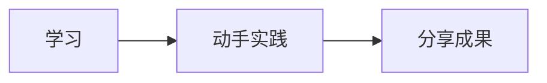
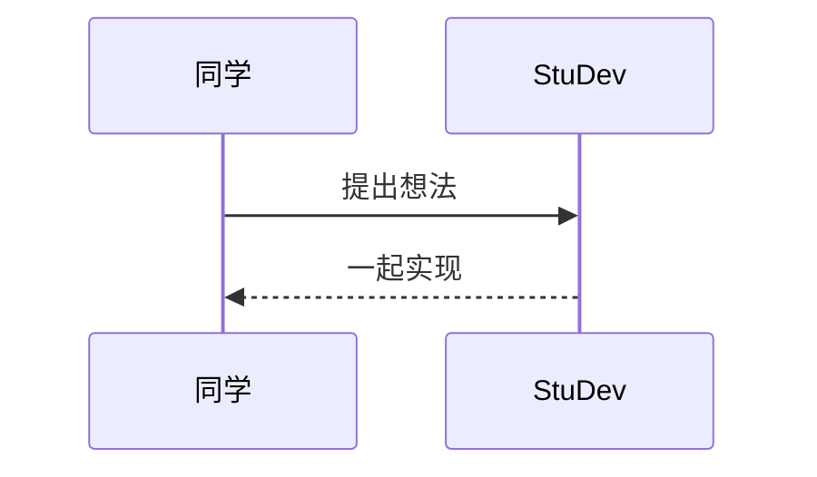

## Flowchart


```mermaid
flowchart LR
  A[学习] --> B[动手实践]
  B --> C[分享成果]
```

## Repeated flowchart


```mermaid
flowchart LR
  A[学习] --> B[动手实践]
  B --> C[分享成果]
```

## Sequence


```mermaid
sequenceDiagram
  participant A as 同学
  participant B as StuDev
  A->>B: 提出想法
  B-->>A: 一起实现
```

## Ordinary code

```js
const firstStar = true;
```
